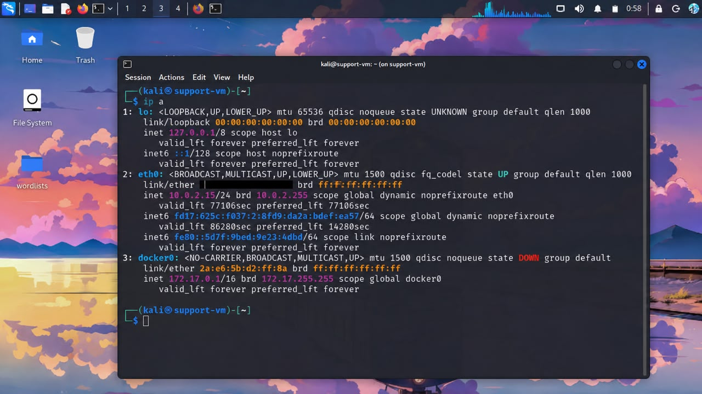
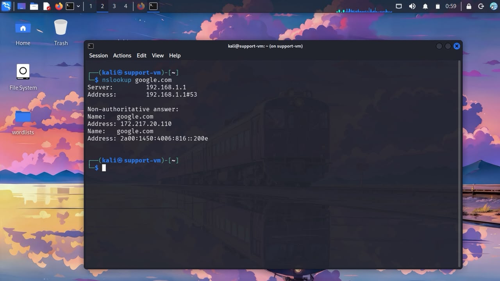
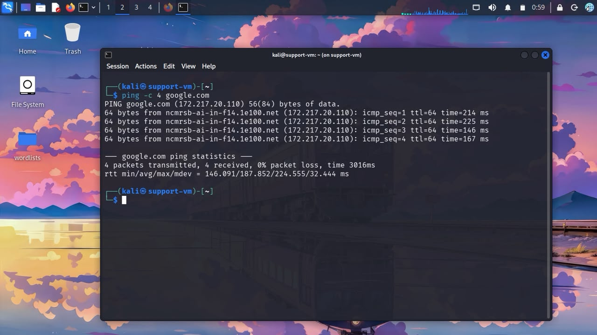

# Network Commands (Cross-Platform Reference)

Quick reference for essential network diagnostic commands, with Windows/Linux equivalents where they differ.

---

## Connectivity Testing

| Purpose | Windows | Linux/Mac |
|---|---|---|
| Test basic connectivity | `ping <host>` | `ping <host>` |
| Trace the path to a host | `tracert <host>` | `traceroute <host>` |
| Show active connections/ports | `netstat -an` | `ss -tulnp` or `netstat -an` |

---

## IP Configuration

| Purpose | Windows | Linux/Mac |
|---|---|---|
| Show network configuration | `ipconfig` | `ip a` or `ifconfig` |
| Show detailed configuration | `ipconfig /all` | `ip a` + `ip route` |
| Release DHCP lease | `ipconfig /release` | `dhclient -r` |
| Renew DHCP lease | `ipconfig /renew` | `dhclient` |

---

## DNS

| Purpose | Windows | Linux/Mac |
|---|---|---|
| Query DNS | `nslookup <domain>` | `nslookup <domain>` or `dig <domain>` |
| Clear DNS cache | `ipconfig /flushdns` | `systemd-resolve --flush-caches` (varies by distro) |

---

## Routing

| Purpose | Windows | Linux/Mac |
|---|---|---|
| Show routing table | `route print` | `ip route` |

---

## Diagnostic Workflow

A practical order for diagnosing most network issues, regardless of OS:

1. **`ping` the default gateway** — confirms local network connectivity
2. **`ping` an external IP** (e.g., 8.8.8.8) — confirms internet connectivity, bypassing DNS
3. **`nslookup`/`dig` a domain** — confirms DNS resolution is working
4. **`ping`/browse the actual domain** — confirms full end-to-end connectivity
5. **`tracert`/`traceroute`** if a specific step is slow — pinpoints where delay is occurring

This order isolates the problem layer by layer — see [Networking/Connectivity.md](../Networking/Connectivity.md) for the full explanation of this approach.

---

## Practical Example (Linux)

Applied example of the diagnostic workflow above, run on a Kali Linux VM configured as a general-purpose lab environment (hostname set to `support-vm`).

**1. Checking IP configuration:**

`ip a` — displays all network interfaces, their assigned IP addresses, and status. MAC address blacked out for privacy.

**2. Testing connectivity:**

`ping -c 4 google.com` — confirms the machine can reach an external host, with 0% packet loss and consistent round-trip times.

**3. Confirming DNS resolution:**

`nslookup google.com` — confirms DNS is resolving the domain correctly, returning both IPv4 and IPv6 addresses via the local DNS server.

Together, these three steps confirm all three layers of the [Networking/Connectivity.md](../Networking/Connectivity.md) model are working: local IP configuration, internet reachability, and DNS resolution.

---

## Related

- [Networking/Connectivity.md](../Networking/Connectivity.md) — the layered diagnostic approach these commands support
- [Networking/DNS.md](../Networking/DNS.md), [Networking/DHCP.md](../Networking/DHCP.md), [Networking/Routing.md](../Networking/Routing.md) — background for each command category
- [Commands/Windows.md](Windows.md) and [Commands/Linux.md](Linux.md) — full OS-specific command references
