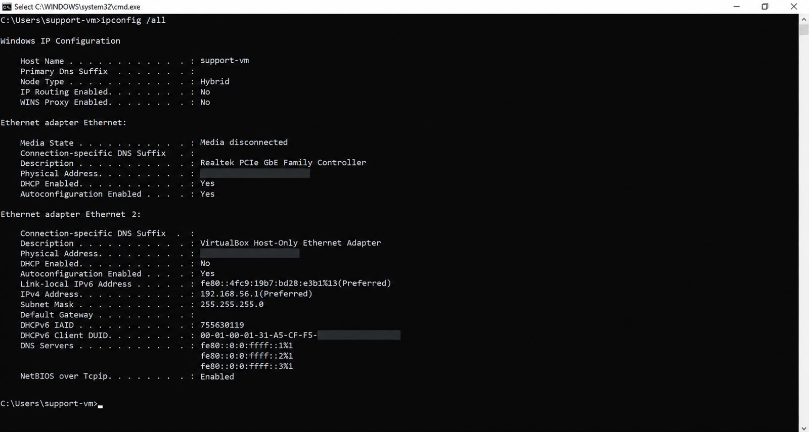
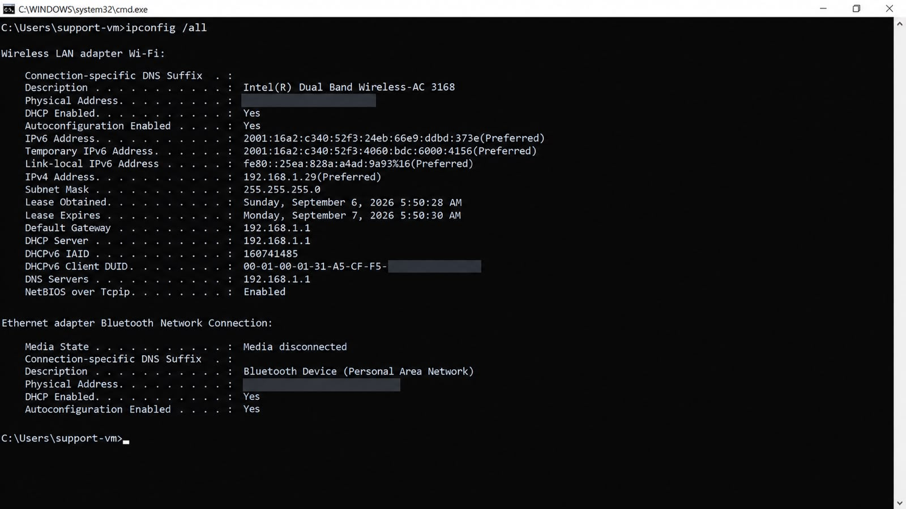
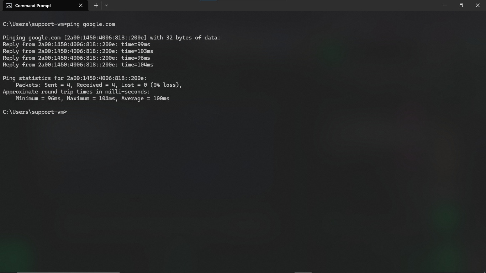
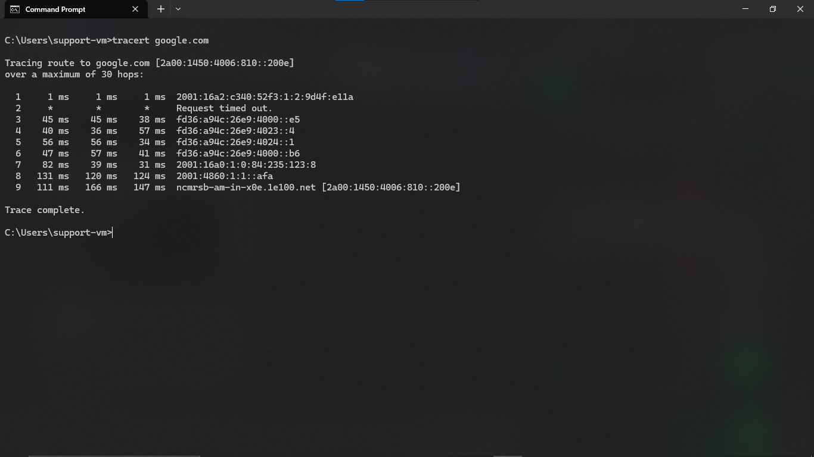
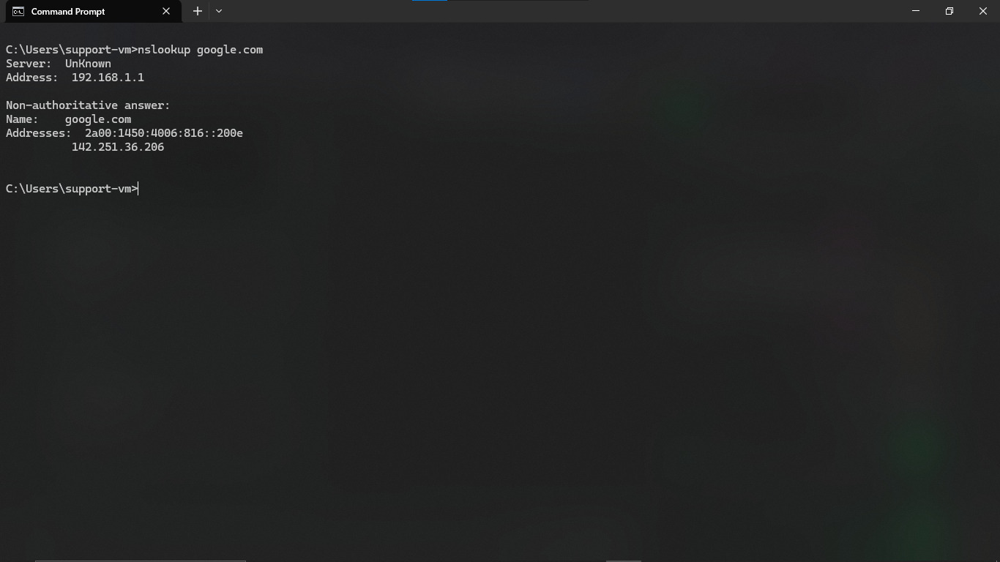

# Windows Commands

Quick reference for commonly used Windows command-line tools (Command Prompt / PowerShell).

---

## Networking

| Command | Purpose |
|---|---|
| `ipconfig` | Displays network configuration (IP, subnet, gateway) |
| `ipconfig /all` | Displays detailed network configuration including DNS servers, MAC address |
| `ipconfig /release` | Releases the current DHCP-assigned IP address |
| `ipconfig /renew` | Requests a new IP address from the DHCP server |
| `ipconfig /flushdns` | Clears the local DNS cache |
| `ping <host>` | Tests basic connectivity and latency to a host |
| `tracert <host>` | Shows the path packets take to reach a destination |
| `nslookup <domain>` | Queries DNS to resolve a domain name |
| `netstat -an` | Displays active network connections and listening ports |

---

## System & Processes

| Command | Purpose |
|---|---|
| `tasklist` | Lists all currently running processes |
| `taskkill /PID <pid>` | Forcefully ends a process by its process ID |
| `taskkill /IM <name>` | Ends a process by its executable name |
| `systeminfo` | Displays detailed system configuration and specs |
| `wmic` | Windows Management Instrumentation command-line, used for detailed system queries |
| `shutdown /r` | Restarts the computer |
| `shutdown /s` | Shuts down the computer |

---

## Services

| Command | Purpose |
|---|---|
| `sc query <service>` | Displays the status of a specific service |
| `net start <service>` | Starts a service |
| `net stop <service>` | Stops a service |
| `services.msc` | Opens the Services management console (GUI) |

---

## User & Account Management

| Command | Purpose |
|---|---|
| `whoami` | Displays the currently logged-in username |
| `net user` | Lists all local user accounts |
| `net user <username>` | Displays details about a specific user account |
| `net localgroup administrators` | Lists members of the local Administrators group |

---

## Disk & Files

| Command | Purpose |
|---|---|
| `chkdsk` | Checks a disk for errors |
| `sfc /scannow` | Scans and repairs corrupted system files |
| `dir` | Lists files and folders in the current directory |
| `del <file>` | Deletes a file |

---

## Practical Example (Windows)

Applied example of basic network diagnostics run on a Windows machine (hostname `support-vm`), following the same layered approach described in [Networking/Connectivity.md](../Networking/Connectivity.md).

**1. Checking IP configuration:**

`ipconfig /all` — displays full network configuration for every adapter on the system (Ethernet, Wi-Fi, Bluetooth, virtual adapters). MAC addresses blacked out for privacy.

**2. Testing connectivity:**

`ping google.com` — confirms the machine can reach an external host, with 0% packet loss and consistent round-trip times (~100ms average).

**3. Tracing the route:**

`tracert google.com` — shows each hop the connection passes through on its way to Google's servers, illustrating the concept covered in [Networking/Routing.md](../Networking/Routing.md). Note hop 2 timing out — a common and normal occurrence when an intermediate device doesn't respond to ICMP requests.

**4. Confirming DNS resolution:**

`nslookup google.com` — confirms DNS is resolving the domain correctly, returning both IPv4 and IPv6 addresses.

Together, these four steps confirm the same diagnostic layers demonstrated in the [Linux example](Network.md#practical-example-linux), showing the same troubleshooting logic applies across operating systems — only the commands differ.

---

## Related

- See [Networking](../Networking/) for background on the networking concepts these commands interact with.
- See [Windows/Services.md](../Windows/Services.md) and [Windows/Performance.md](../Windows/Performance.md) for context on when to use these tools.
